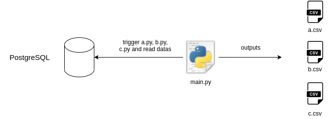

## Req-1

Bu modül `PostgreSQL`' e yazılan orders ve product-views verileri kullanılarak aşağıdaki işlemler gerçekleştirir;
1. farklı kullanıcıların, her bir kategoride en fazla görüntülediği 10 ürünü
2. farklı kullanıcıların, her bir kategoride en fazla satın alıdığı 10 ürünü
3. her kategiri için (satın alınan / görünlenen) oranı


## İçindekiler

* [Nasıl Kurulur](#nasıl-kurulur)
* [Çalışma Sistemi](#calisma-sistemi)
* [Nasıl Çalıştırılır](#nasıl-çalıştırılır)
* [Eksikler ve Hatalar](#eksikler-ve-hatalar)

### Nasıl kurulur?

Sistem veritabanı sorguları için `psycopg2` modülü kullanmaktadır. Bu modülü linux ortamında kullanmak için `libpq-dev`' i kurmamız gerekir (ne işe yarar bilmiyorum)

```
sudo apt-get install libpq-dev
```

Sistemin çalışması için gerekli `python` kütüphanelerini ise aşağıdaki komutla kurabilirsiniz;

```
pip3 install -r requirements.txt
```

### Calisma Sistemi



Yukarıdaki resimde de görüldüğü gibi `main.py` dosyası `a.py`, `b.py`, `c.py` script' lerini çalıştırır ve gerekli script' ler gerekli csv dosyalarını oluşturur.

Gerekli olan sorgular `sql.py` dosyasından elde edelir.

Veritabanı bağlantısı `conn.py`' dan elde edilir.

Veritabanı bağlantısı için gereken şeyler `config.yml` dosyasında `config.py` ile elde edilir.

Aşağıda klasör yapısını görebilirsiniz.

```bash
.
├── main.py
├── README.md
├── requirements.txt
└── src
    ├── a.py
    ├── b.py
    ├── config.py
    ├── config.yml
    ├── conn.py
    ├── c.py
    └── sql.py

1 directory, 10 files
```

### Nasıl çalıştırılır?

```
python3 main.py
```


### Eksikler ve Hatalar

1. Kod yazılım kötü